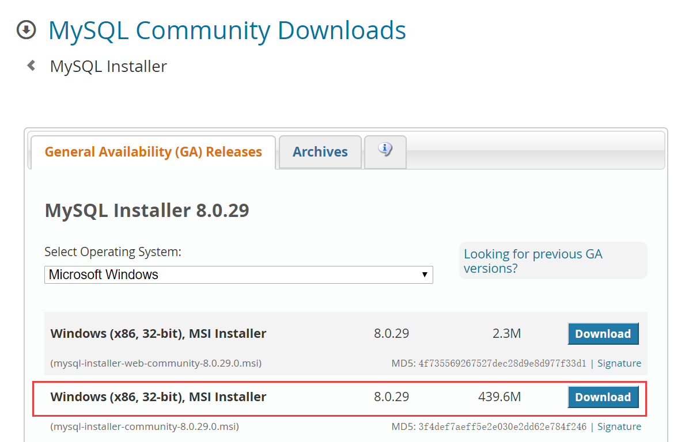
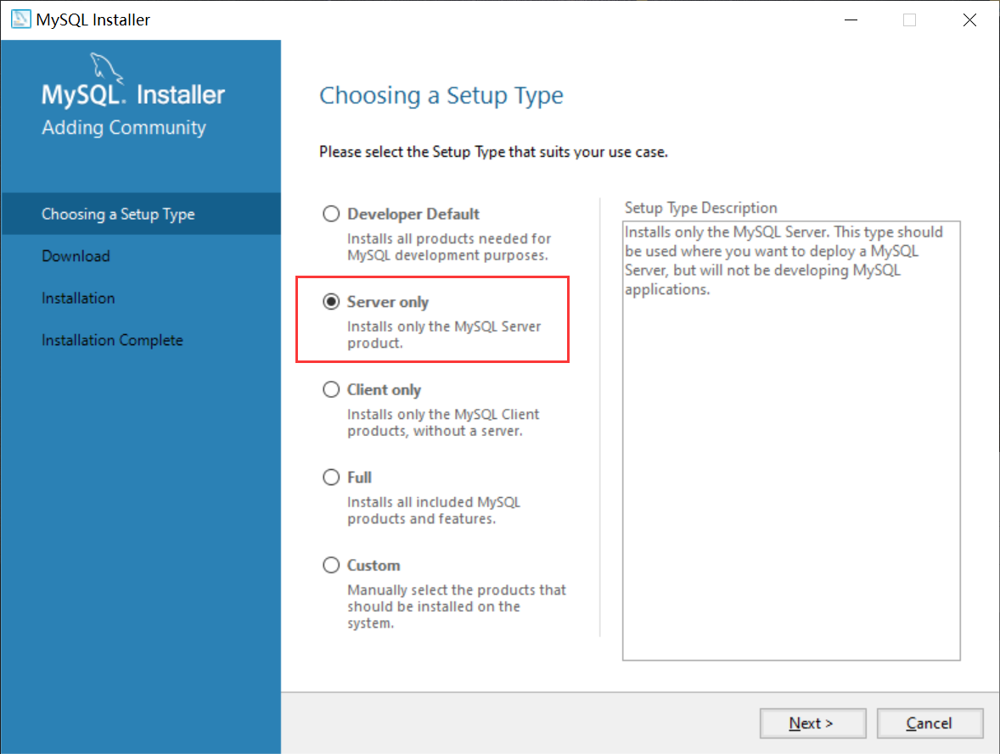
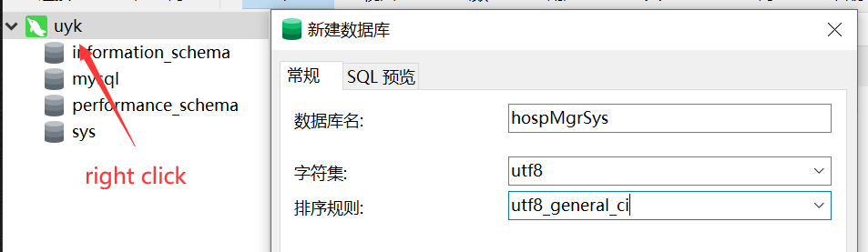
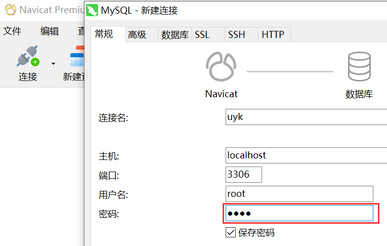

### Install

#### python pack

LTS django：pip install django==3.2.*

db-mysql：pip install mysqlclient

Django Rest Framework：pip install djangorestframework

django - filter：pip install django-filter

---

\# pip install -r requirements.txt

清华源： -i https://pypi.tuna.tsinghua.edu.cn/simple

---

#### mysql

https://dev.mysql.com/downloads/installer/

选择 server only，并记住后续步骤输入的 `密码`

#### Navicat

https://navicat.com.cn

**连接数据库**

密码为安装 mysql 时输入的密码

**新建数据库**

