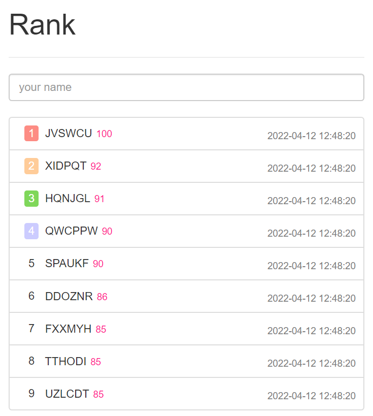

使用 flask+vue+bootsharp+axios+sqlite3 搭建的排行榜.

#### Refer

vuejs: https://cdn.jsdelivr.net/npm/vue@2/dist/vue.js

bootstrap: https://v3.bootcss.com

flask: https://www.cainiaojc.com/flask/flask-sqlite.html

sqlite3: https://blog.csdn.net/weixin_42128676/article/details/112753874

​              https://www.runoob.com/sqlite/sqlite-order-by.html

#### UI

